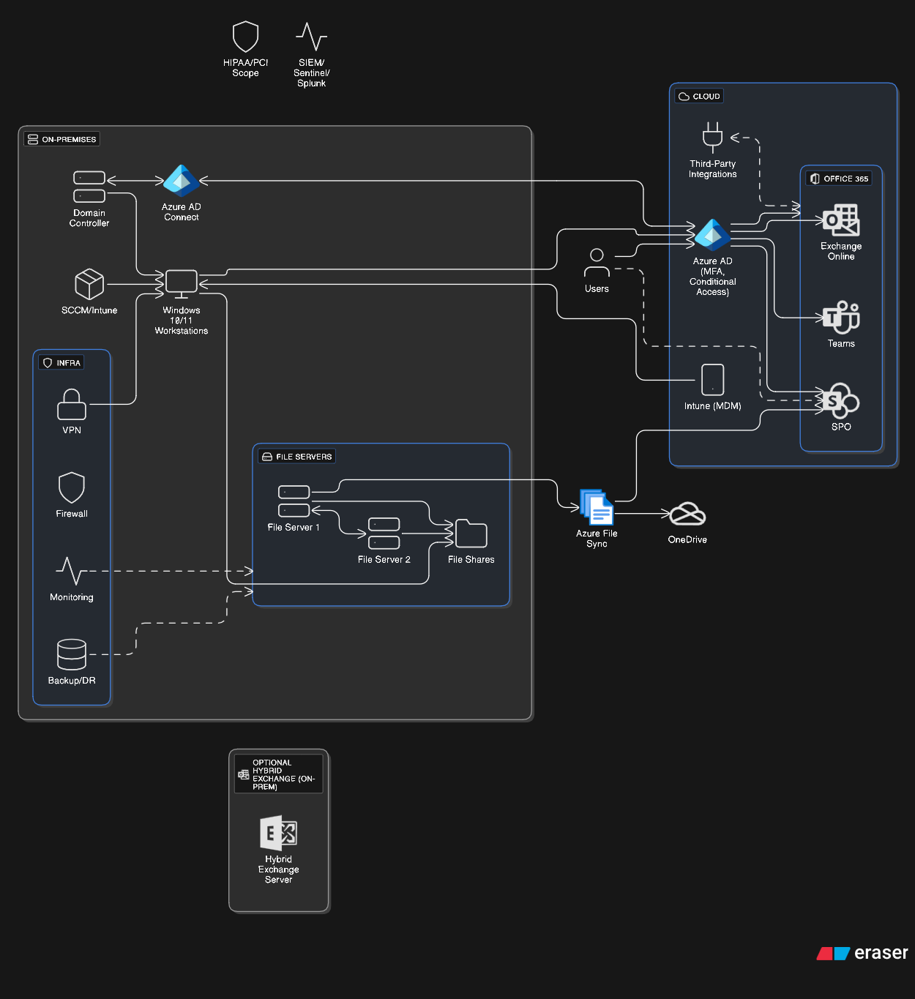

# Hybrid AD / Azure AD / O365 Lab  

This repo documents my homelab simulating enterprise-scale identity and systems management.  
It demonstrates integration between on-prem Active Directory, Azure AD, and Microsoft 365.
  
## Architecture Diagram  

## What’s Included (Diagrammed)  
- On-prem Active Directory domain (lab.local) with OUs, groups, and Group Policies.  
- Azure AD + Microsoft 365 tenant sync via Azure AD Connect.  
- Windows 10/11 clients joined to the domain.  
- File shares with NTFS permissions and DFS namespaces/replication.  
- Application deployment with SCCM (ConfigMgr).  
- Azure File Sync to OneDrive.  
- Office 365 services (Exchange Online, Teams, SharePoint Online) with SSO, MFA, and Conditional Access.  
- Security overlays: HIPAA/PCI compliance scope, monitoring/logging, and SIEM (Sentinel/Splunk).  

## Extensions (Not in Diagram Yet)  
- **Terraform** (AWS VPC + EC2) for cloud infrastructure automation.  
- **Ansible** for Windows configuration management.  

## Why This Lab?  
To practice:  
- Hybrid identity management.  
- GPO and file share administration.  
- Application deployment and automation.  
- Cloud service integration (Office 365 + OneDrive).  
- Security monitoring and compliance alignment.  

## Next Steps  
- Expand Terraform to Azure IaaS resources.  
- Automate Intune app deployment.  
- Add Splunk/Sentinel SIEM detection queries.  
